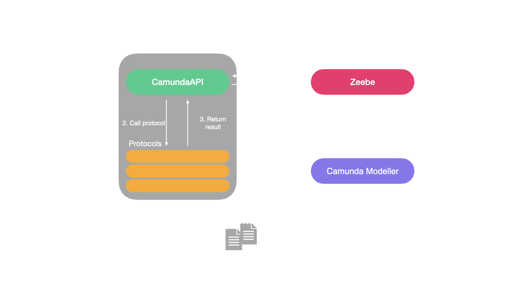
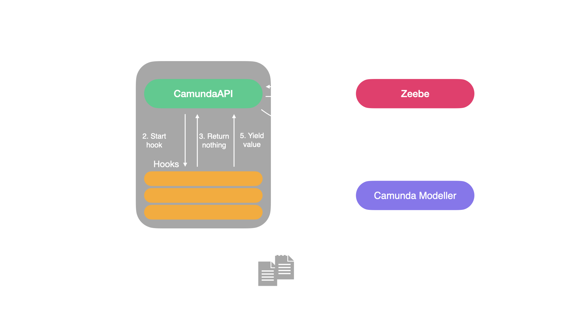

# CamundaAPI

## What is it?

CamundaAPI is a Constelite API that creates a bridge to a zeebe server, making it possible to call protocols from Camunda engine (either Cloud or self-hosted).

## How it works

API can generate service task templates (in a form of json files) that can be imported into Camunda modeller (either local or cloud). Each protocol produces one template.

You can use templates to include service tasks that call protocols in your process diagrams.

When API is started it connects to the zeebe server and listens for any service task calls that have type matching the slug of any of the protocols.

When zeebe gets to a service task, Camunda API picks it up, executes the corresponding protocol and returns a message with the return value back to the service task.

### Hooks

In addition, CamundaAPI supports hooks (or "incoming connectors" in Camunda terminology).

CamundaAPI generates a template for each hook, similar to how it does for protocols. The logic is slightly different though.

While protocols block the execution of the workflow until the result is returned, calling a hook service task start the hook process and returns back to the engine so the process can carry on. To catch the return of the hook you must use an "Message catch event", which will stop the process and wait until the hook sends something back.

Hooks are useful when you want to wait for an event to happen, e.g. when you want to wait for a Notion page to change status.