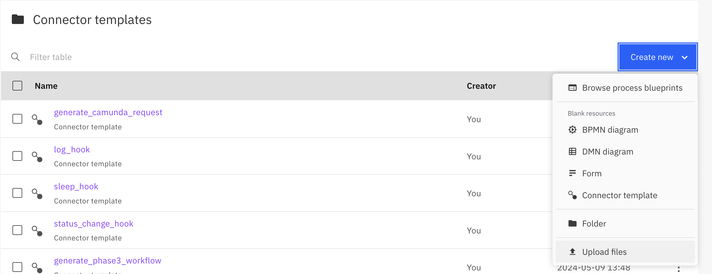
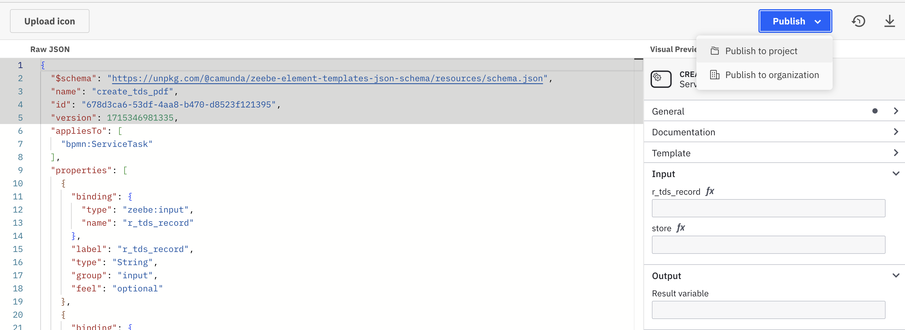
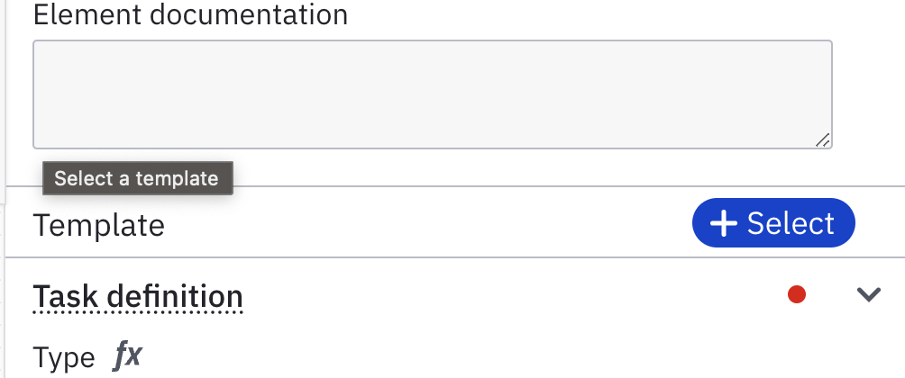
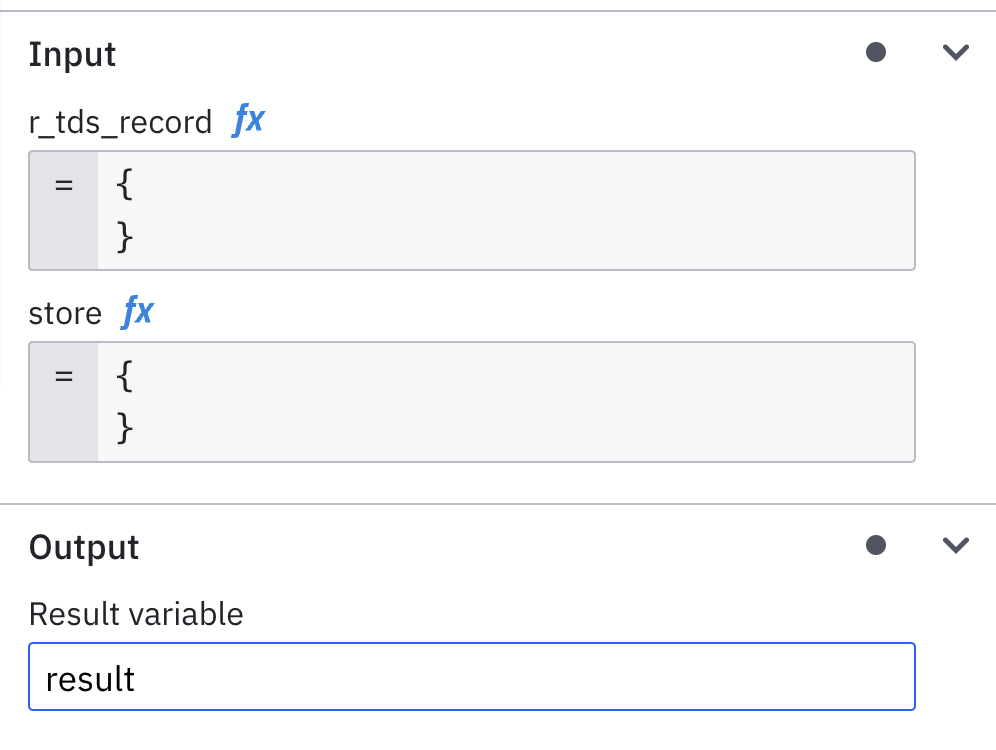
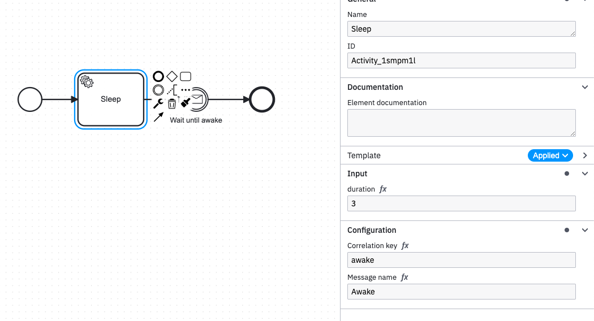
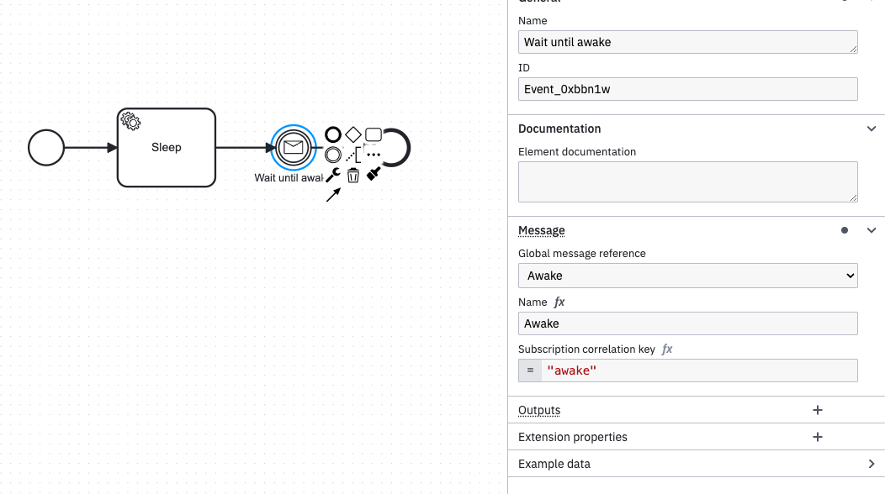

# Camunda

## Importing templates

When you start CamundaAPI using

```
poetry run colorifix_alpha/camunda_api.py
```

it will generate all templates in `colorifix_alpha/camunda_templates`

In this guide, we are using `create_tds_pdf` protocol.

### Cloud

* Log in to [Camunda cloud modeller](https://modeler.cloud.camunda.io/) and go to `Colorifix/Connector templates`.



* Click on "Create New" -> "Upload files" and upload the template.



* Open the template and click "Publish" -> "Publish to project". This will make the template available in your process diagrams.


### Local

* Open the Camunda Modeller package (right click on the Camunda Modeller app -> "Show package content")

* Go to "/Contents/MacOS"

* Create a "/Contents/MacOS/resources/element-templates" directory.

* Copy templates from "colorifix_alpha/camunda_templates" to "/Contents/MacOS/resources/element-templates"

## Starting API

You can start CamundaAPI with

```console
$ constelite/colorifix_alpha: $ poetry run python camunda_api.py 
```

!!! note
    By default, CamundaAPI will connect to the Camunda Cloud using credentials in the config. If you want to run locally, uncomment the local config section in `camunda_api.py`.

    In development, use [local Camunda stack](https://github.com/camunda/camunda-platform) as we have limited free process runs in the cloud.  

## Setting up Constelite environment


Since we deploy every branch of Constelite in GitLab, there can be multiple CamundaAPI instances running at the same time. To specify which environment you want yo use, you must specify a `consteliteEnvironment` process variable.

!!! note
    The easiest way to specify `consteliteEnvironment` is to add an output on the process start event.

If you want to run protocols and hooks in deployed environments, use `$PROJECT_NAME` as `consteliteEnvironment`, e.g. "constelite-feature-camunda-api". If you want to run in local environment use your hostname.

!!! info
    You can find out your hostname by typing `hostname` in terminal.


## Calling protocols from Camunda 

* In your process diagram, add a Service Task.



* In the side panel Template section, click on "+Select" and select the template.



* Now you can pass parameters to the service task in the Input section and set the name of the return variable where the result of the service task will be store.

## Staring hooks from Camunda

Working with hooks requires two artifacts in the diagram. First, you need a service task to start the hook. Then, you need an intermediate catch event to receive callbacks from the hook.

For example, let's consider a simple hook:

```python
class SleepHook(Hook):
    """Seep for given duration in seconds before triggering a hook.
    """
    duration: int

    async def run(self, api, logger) -> bool:
        await logger.log(f"Sleeping for {self.duration} seconds")
        await asyncio.sleep(self.duration)
        yield True
```

We will set up a service task using "SleepHook" template.



Apart from the field defined in the hook code, we are also required to provide a correlation key and a message name. Both are used to correlate the message returned from the hook to the specific catch event.



On the intermediate catch event, we must use the same message name and corelation key to catch the message.